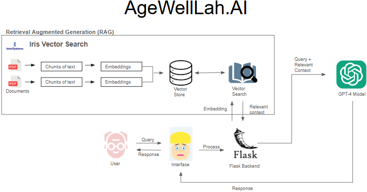

<h1>AgeWellLah.AI</h1>


🚀 <strong>HealthHack 2025 Project</strong>

We would like to extend our sincere gratitude to **Iris Systems** for providing us with the opportunity to build our project on their GitHub repository for the **InterSystems IRIS Data Platform**. Their support has been invaluable in enabling us to develop and experiment with innovative solutions.  

[](https://github.com/intersystems-community/hackathon-2024/tree/main)

<h2>Overview</h2>
<p>AgeWellLah.AI enhances <strong>value-based healthcare</strong> using AI to track and improve patient outcomes across various care settings. Our AI-powered chatbot provides:</p>

<table>
  <tr>
    <th>✅ Personalized Daily Planners</th>
    <th>✅ Food Recommendations</th>
    <th>✅ Doctor’s Note Assistance</th>
  </tr>
  <tr>
    <td>Helps structure daily activities</td>
    <td>Tailored nutrition advice</td>
    <td>Streamlined medical documentation</td>
  </tr>
</table>

<p>By leveraging <strong>InterSystems IRIS</strong> for data management and the <strong>OpenAI API</strong> for context-aware responses, our solution helps:</p>

<table>
  <tr>
    <th>🔹 Reduce Hospital Readmissions</th>
    <th>🔹 Improve Medication Adherence</th>
    <th>🔹 Prevent Falls & Enhance Care</th>
  </tr>
  <tr>
    <td>Minimize avoidable returns</td>
    <td>Ensure regular medication intake</td>
    <td>Proactive fall prevention</td>
  </tr>
</table>


<h2>Setup</h2>

_Prerequisite_ - [Docker](https://www.docker.com) must be installed and running for the commands below to work!


1. Install IRIS Community Edtion in a container. This will be your SQL database server.
    ```Shell
    docker run -d --name iris-comm -p 1972:1972 -p 52773:52773 -e IRIS_PASSWORD=demo -e IRIS_USERNAME=demo intersystemsdc/iris-community:latest
    ```
After running the above command, you can access the System Management Portal via http://localhost:52773/csp/sys/UtilHome.csp.


2. Create a Python environment and activate it with Python version 3.12.8:
   
    venv (Windows):
    ```Shell
    python3 -m venv iris-env
    .\iris-env\Scripts\Activate
    ```
3. Install packages for all demos -- *Note*: This command might take a while to run (as it freezes for some time which looks like its stuck):
    ```Shell
    pip install -r requirements.txt
    ```

4. Run load_and_test.ipynb https://github.com/ZulfaqarHafez/AgeWellLah.AI/blob/main/demo/load_and_test.ipynb to setup and store Demo Patient Report in Vector Database

5. Run main.py https://github.com/ZulfaqarHafez/AgeWellLah.AI/blob/main/Apps/chatbot/main.py to use the chatbot 
  
<h2>🔗 Technologies Used</h2>

<ul>
  <li>📌 <strong>InterSystems IRIS</strong> – Robust data management</li>
  <li>🤖 <strong>OpenAI API</strong> – Intelligent, context-aware responses</li>
  <li>💡 <strong>AI Chatbot</strong> – Personalized healthcare assistance</li>
</ul>

<p>🚀 <strong>Join us in shaping the future of AI-driven healthcare!</strong> 🚀</p>

<h2>Team Members</h2>
<table>
  <tr>
    <td align="center">
      <br>
      <a href="https://www.linkedin.com/in/kevansoon/" target="_blank"><strong>Kevan Soon</strong></a>
    </td>
    <td align="center">
      <br>
      <a href="https://www.linkedin.com/in/zulfaqarhafez/" target="_blank"><strong>Zulfaqar Hafez</strong></a>
    </td>
    <td align="center">
      <br>
      <a href="https://www.linkedin.com/in/rahul-mitra-2oo2"><strong>Rahul Mitra</strong></a>
    </td>
  </tr>
</table>

